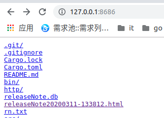
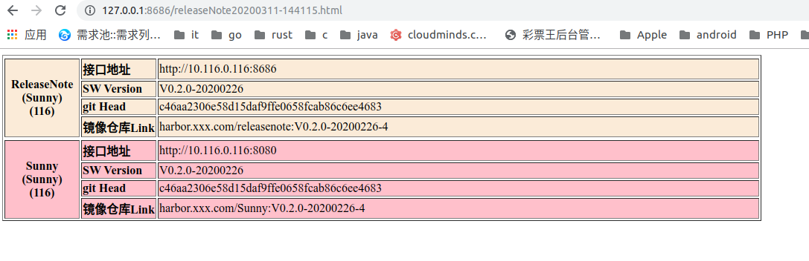
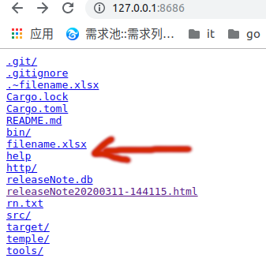
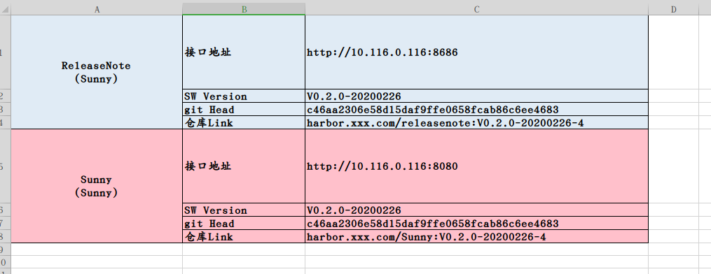

# ReleaseNote 生成器说明

### Revision history

| NO. | Name | Change detail |  Revision    |Memo|
|---:|:---|:---:|---|---|
| 1| Sunny|2020/01/11 | V0.2.0 |今天是在望京SOHO疫情期间上班|

###  缘起

  是因为公司的Release Note实在是有点麻烦，各种环境。必须吐槽110 、 134 、 135 、136 、 137 、 138 、221、 231、 251。<br />
 我使用rust、Go 、sqlite3 混合开发做了个小工具。可以生成HTML和excel的xlsx文件。

###  数据录入结构

``` go
{"env":"136","owner":"Sunny","name":"SmartOMP","version":"V1.0.1.3-20200226","address":"http://10.xxx.0.136:32175","git":"c46aa2306e58d15daf9ffe0658fcab86c6ee4683","docker":"harbor.xxx.com/crss/smartomp:V1.0.1.3-20200226-4","pubtime":"2020-03-02 20:58:25"}
```

### 目录结构

```go
├── README.pdf           # README
├── rn.txt                          # 录入的信息
├── bin                              # 执行目录
│   ├── releasenote     # 主程序(rust)
│   ├── sunnyhttp        # 简单web服务器，端口8686(go)
│   └── rn_excel            # 生成excel工具(go)
├── temple                      # 生成html模板目录
│   ├── header.tpl        # 文件头
│   ├── footer.tpl          # 文件尾
│   └── tr.tpl                   # 具体表格的模板
```

### 具体操作

#### releasenote

```go
Sunnycat Version:0.2.0  git:
Release Note 的工具.
        例子:./relelaenote --help

USAGE:
    releasenote [FLAGS] [OPTIONS]

FLAGS:
    -c, --createdb    创建数据库
    -h, --help        Prints help information
    -i, --insert      插入数据库
    -V, --version     Prints version information

OPTIONS:
    -H, --html <ENV>     数据库到HTML
    -s, --show <NAME>    显示某个name的信息
```

    releasenote -c
    releasenote -i
    releasenote -H ""


 #### sunnyhttp

     sunnyhttp &

效果如下：





#### re_excel  

    rn_excel  filename.xlsx 116


效果如下：



